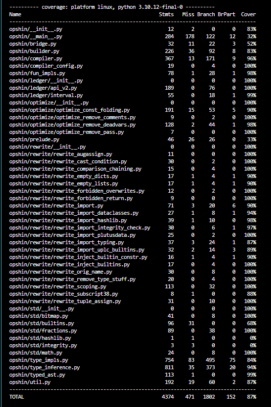

# Opshin - Language analysis Report

## Table of Contents

1. [Introduction to OpShin](#introduction-to-opshin)
2. [Syntax Analysis](#syntax-analysis)
3. [Type System](#type-system)
4. [Compilation and Execution](#compilation-and-execution)
5. [Quantitative Metrics](#quantitative-metrics)
6. [Metrics using Gastronomy](#metrics-using-gastronomy)
7. [Code Coverage Percentage](#code-coverage-percentage)
8. [Manual Review Findings](#manual-review-findings)
9. [Summary of Current Findings Across Categories](#summary-of-findings-across-categories)
10. [Recommendations for Improvements](#recommendations-for-improvements)

## Introduction to OpShin

OpShin is a programming language for developing smart contracts on the Cardano blockchain.
It's syntax is 100% valid Python code and it aims to lower the barrier to entry for Cardano smart contract development.
This approach allows developers to write smart contracts using familiar Python constructs while still benefiting from Cardano's robust and secure execution environment.

OpShin ensures that contracts evaluate on-chain exactly as their Python counterpart.
This allows unit tests and verification of the Python code using standard tooling available for Python development.
The type system of opshin is much stricter than the type system of Python, so that many optimizations can be implemented and an elevated level of security is provided.

## Syntax Analysis

OpShin presents itself as a restricted version of Python, written specifically for smart contract development on the Cardano blockchain.
While it encourages developers to write code as they would in standard Python programs, it's important to note that not all Python features are available in OpShin.

OpShin's approach ensures that if a program successfully compiles, it meets two crucial criteria.
First, the source code is guaranteed to be a valid Python program.
Second, OpShin ensures that the output of running the compiled program with Python is identical to its execution on-chain.

## Type System

One of the limitations of using Python as-is for smart contract development is that it is dynamically typed.
Opshin addresses this concern by introducing a strict type system on top of Python.
What Opshin does is have an independent component called the 'aggressive static type inferencer', which can infer all types of the Python AST nodes for a well chosen subset of Python.
So in simple terms every variable in OpShin has a type.
There are no opaque types in OpShin, everything can be deconstructed.

Currently, OpShin supports only Lists and Dicts.
It does not support tuples and generic types, which we see as a limitation, as these can be really valuable when writing smart contracts.
This limitation of not supporting tuples and generic types might require workarounds to achieve the desired functionality.

## Compilation and Execution

OpShin provides a toolkit to evaluate the script in Python, compile the script to UPLC, and compile the script to `pluto`, an intermediate language for debugging purposes.

It offers a straightforward API to compile, load, apply parameters and evaluate smart contracts locally.
The build process creates all required files for integration with off-chain libraries like pycardano and LucidEvolution.
Key features include the ability to build validators from Python files, apply parameters during or after compilation, store and load compilation artifacts, and access important contract information such as addresses and blueprints.

# Quantitative Metrics

## Metrics using Gastronomy

We analysed the UPLC code generated by OpShin for a sample validator which adds number 1 to the input that is passed, using `Gastronomy` as the UPLC debugger.

```python
def validator(m : int)-> int:
    return m + 1
```

```uplc
(lam
  1val_param0
  [
    (lam
      n_1
      [
        (lam
          validator_0
          [
            (lam
              validator_0
              [
                (builtin iData)
                [
                  (lam 1p0 [ (force validator_0) (delay 1p0) ])
                  [ (builtin unIData) 1val_param0 ]
                ]
              ]
            )
            (delay
              (lam
                n_1
                [
                  [
                    (lam
                      1self
                      (lam 1other [ [ (builtin addInteger) 1self ] 1other ])
                    )
                    (force n_1)
                  ]
                  (con integer 1)
                ]
              )
            )
          ]
        )
        (delay
          [
            (lam _ (error ))
            [
              [ (force (builtin trace)) (con string "NameError: validator") ]
              (con unit ())
            ]
          ]
        )
      ]
    )
    (delay
      [
        (lam _ (error ))
        [
          [ (force (builtin trace)) (con string "NameError: n") ] (con unit ())
        ]
      ]
    )
  ]
)
```

The two lambda functions with parameter names `n_1` and `validator_0` correspond to the variables named `n` and `validator`, respectively.
These variables, however, are not being used.
Also, this has the effect that script sizes are usually bigger then strictly necessary.
Though Opshin supports optimization to remove dead variables and constants these variables are not removed as
this behavior is expected by the OpShin code, which assumes that it will always be able to access these variables without generating invalid UPLC.

# Code Coverage Percentage

We conducted a code coverage analysis for the OpShin project using the `pytest-cov` tool.
Code coverage is a metric that helps to understand which parts of the codebase are exercised by the test suite, allowing us to identify untested areas.

The following screenshot shows the results of the code coverage assessment:



# Manual Review Findings

The document herein is provided as an interim update detailing the findings of our ongoing audit process on the opshin repository.
It is crucial to understand that this document does not constitute the final audit report.
The contents are meant to offer a preliminary insight into our findings up to this point and are subject to change as our
audit progresses.

## Summary of Current Findings Across Categories

1. Security - 0
2. Performance - 1
3. Maintainability - 4
4. Others - 0

# Recommendations for Improvements

## Finding01 - Improving Error Clarity

While the `opshin eval` command provides a valuable tool for evaluating scripts in Python, its error reporting can be enhanced to provide more user-friendly and informative feedback.
Currently, when incorrect arguments or mismatched types are provided, the error messages may not clearly indicate the source or nature of the problem.
We recommend implementing more specific error messages that pinpoint the problematic argument, indicate its position, and clearly state the expected type.
Additionally, echoing the provided input, and suggesting corrections, for detailed debugging information could significantly improve the user experience and reduce troubleshooting time.
These enhancements would make the tool more accessible, especially for developers new to OpShin or smart contract development on Cardano.

## Recommendation

```py
def validator(datum: WithdrawDatum, redeemer: None, context: ScriptContext) -> None:
    sig_present = datum.pubkeyhash in context.tx_info.signatories
    assert (
        sig_present
    ), f"Required signature missing, expected {datum.pubkeyhash.hex()} but got {[s.hex() for s in context.tx_info.signatories]}"
```

When this command is executed in the CLI

        `opshin eval spending examples/smart_contracts/gift.py "{\"constructor\": 0,\"fields\":[
        {\"bytes\": \"1e51fcdc14be9a148bb0aaec9197eb47c83776fb\"}]}" "None" d8799fd8799f9fd8799fd8799fd8799f582055d353acacaab6460b37ed0f0e3a1a0aabf056df4a7fa1e265d21149ccacc527ff01ffd8799fd8799fd87a9f581cdbe769758f26efb21f008dc097bb194cffc622acc37fcefc5372eee3ffd87a80ffa140a1401a00989680d87a9f5820dfab81872ce2bbe6ee5af9bbfee4047f91c1f57db5e30da727d5fef1e7f02f4dffd87a80ffffff809fd8799fd8799fd8799f581cdc315c289fee4484eda07038393f21dc4e572aff292d7926018725c2ffd87a80ffa140a14000d87980d87a80ffffa140a14000a140a1400080a0d8799fd8799fd87980d87a80ffd8799fd87b80d87a80ffff80a1d87a9fd8799fd8799f582055d353acacaab6460b37ed0f0e3a1a0aabf056df4a7fa1e265d21149ccacc527ff01ffffd87980a15820dfab81872ce2bbe6ee5af9bbfee4047f91c1f57db5e30da727d5fef1e7f02f4dd8799f581cdc315c289fee4484eda07038393f21dc4e572aff292d7926018725c2ffd8799f5820746957f0eb57f2b11119684e611a98f373afea93473fefbb7632d579af2f6259ffffd87a9fd8799fd8799f582055d353acacaab6460b37ed0f0e3a1a0aabf056df4a7fa1e265d21149ccacc527ff01ffffff`

Error Encountered:

        `ValueError: Expected hexadecimal CBOR representation of plutus datum but could not transform hex string to bytes`.

The error is caused by the second argument, where "None" is passed instead of a valid Plutus data object for Nothing.
The error message could be improved by providing a clear example of how to pass parameters correctly in JSON format.

## Finding02 - Attaching file name to title in '.json' file

At present, the `opshin build` command compiles the validator,creates a target "build" directory and writes the artifacts to the build folder under the file name.
The `blueprint.json` file is created, containing the compiled code, datum, and redeemer details.
However, the field `title` in the blueprint.json file will always remain as "validator" as being assigned in the code.

## Recommendation

Although the file `blueprint.json` is primarily used for off-chain coding purposes, adding the validator file name along with the keyword 'Validator' as a title (e.g., Validator/assert_sum) would be helpful for debugging and referencing during off-chain validation.

## Finding03 - Pretty Print generated UPLC

When the OpShin code is compiled to UPLC using the `opshin eval_uplc` or `opshin compile` commands, the generated UPLC code is not formatted in a 'pretty-printed' form.
Instead, it is output directly to the terminal in a compact, unformatted style.
This lack of formatting can make it more challenging to analyze or debug the resulting UPLC code, as the structure and readability of the code are compromised, which can hinder efficient examination and optimization.

## Recommendation

To improve the development experience, it would be beneficial to implement a method or tool that formats the UPLC output and saves it in a folder for easier interpretation and review.

## Finding04 - Opshin build lib does not build the artifacts

The command `opshin build lib examples/smart_contracts/assert_sum.py -fno-remove-dead-code` was suggested by the cli to build artifacts for a smart contract with a different validator name other than "validator". However, this command did not work as expected.

## Recommendation

When the command `opshin build lib examples/smart_contracts/assert_sum.py -fno-remove-dead-code` is executed, the maximun recursion limit exception is thrown.
However even after increasing the recursion limit, the artifacts were not built.
As per the Opshin code, at [Line 386](https://github.com/OpShin/opshin/blob/d657a227f02670e6b6eed9cac77c0f8a25d51423/opshin/__main__.py#L386) when the purpose is `lib` the artifacts are built but not dumped into target directory.

## Finding05 - Documentation on Integrity Checks and optimization level

The idea of Optimization level and how the UPLC differs with each optimization level can be clearly documented with simple examples.

## Recommendation

Currently, there is no clear documentation detailing the different optimization levels and the specific constraints that are enabled with each level.
Providing this information would benefit users of Opshin, as it would give them a better understanding of which optimization configuration to choose based on their smart contract logic.

When building compiled code, Opshin could use the most aggressive optimizer, O3, as the default optimization configuration. This would allow users to directly utilize the optimized code without needing to specify any optimization levels during the build process.
